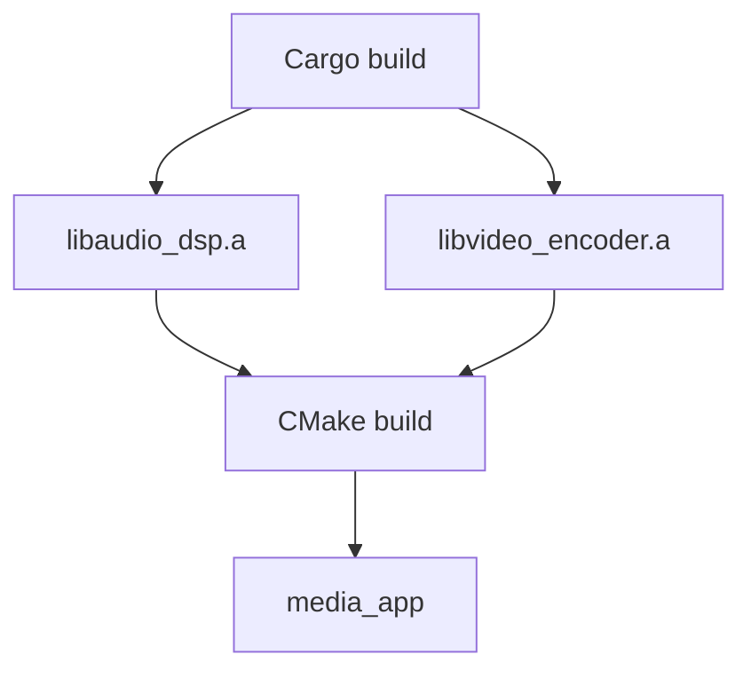

# 아키텍처 문서

## 개요

Hybrid Media Engine은 C++와 Rust를 결합하여 고성능 멀티미디어 처리를 제공하는 프로젝트입니다.

## 설계 철학

### 왜 C++와 Rust를 함께 사용하는가?

1. **C++의 강점 활용**
   - 기존 멀티미디어 라이브러리와의 호환성
   - 하드웨어 수준 제어
   - 레거시 코드 통합

2. **Rust의 강점 활용**
   - 메모리 안전성
   - 동시성 처리 (fearless concurrency)
   - 현대적인 패키지 관리 (Cargo)

3. **최적의 조합**
   - C++: UI, 하드웨어 인터페이스, 레거시 통합
   - Rust: 핵심 로직, 병렬 처리, 데이터 변환

## 모듈 설계

### Core (C++)

```
core/
└── utils/
    ├── logger.h/cpp      # 싱글톤 로거
    └── memory_pool.h/cpp # 고정 크기 메모리 풀
```

**책임**:
- 공통 유틸리티 제공
- 플랫폼 추상화
- 리소스 관리

### Audio DSP (Rust)

```
rust-modules/audio-dsp/
└── src/
    ├── lib.rs    # FFI 경계
    └── mixer.rs  # 순수 로직
```

**설계 원칙**:
- Pure Logic: 외부 의존성 최소화
- FFI 레이어와 비즈니스 로직 분리
- 테스트 용이성

**주요 기능**:
- 멀티채널 오디오 믹싱
- 실시간 볼륨 조절
- 클리핑 방지

### Video Encoder (Rust)

```
rust-modules/video-encoder/
└── src/
    ├── lib.rs       # FFI 경계
    └── pipeline.rs  # 비동기 파이프라인
```

**설계 원칙**:
- Async Worker 패턴
- 채널 기반 통신 (crossbeam)
- 백프레셔 관리

**주요 기능**:
- 비동기 프레임 처리
- 멀티스레드 인코딩
- 통계 수집

## FFI 설계

### C++ → Rust

```c
// 불투명 포인터 사용
typedef struct AudioMixer AudioMixer;

// C ABI 함수
AudioMixer* audio_mixer_create(size_t channel_count);
void audio_mixer_destroy(AudioMixer* mixer);
```

**원칙**:
1. **C ABI 사용**: `extern "C"`로 안정적인 인터페이스
2. **불투명 포인터**: 내부 구현 숨김
3. **명시적 생명주기**: create/destroy 쌍
4. **에러 처리**: bool 반환 또는 null 체크

### Rust → C++ (향후)

```rust
pub type LogCallback = extern "C" fn(level: i32, message: *const c_char);
```

**용도**:
- 로깅 콜백
- 진행 상황 알림
- 에러 리포팅

## 메모리 관리

### 소유권 모델

1. **Rust 소유 데이터**
   - Rust에서 할당: `Box::new()`
   - Rust에서 해제: `Box::from_raw()` + `drop()`
   - C++는 불투명 포인터로만 접근

2. **C++ 소유 데이터**
   - C++에서 할당/해제
   - Rust는 빌린 참조로만 접근 (`&[u8]`)

3. **공유 데이터**
   - 명시적 복사 또는
   - 공유 메모리 + 동기화 프리미티브

### Zero-Copy 전략

```rust
// 포인터로 전달, 복사 없음
pub extern "C" fn process_frame(
    data: *const u8,
    size: usize
) {
    let slice = unsafe { std::slice::from_raw_parts(data, size) };
    // slice 사용 (빌림만)
}
```

## 동시성 모델

### Video Encoder 파이프라인

```
[C++ Thread]           [Rust Worker Thread]
     |                         |
     | submit_frame()          |
     |------- frame --------->|
     |      (channel)          |
     |                    encode()
     |                    encode()
     |                    encode()
     | get_stats()            |
     |<------ stats ----------|
```

**구성 요소**:
- **Bounded Channel**: 백프레셔 제어 (64 프레임)
- **Worker Thread**: 독립적인 인코딩 루프
- **Atomic Stats**: lock-free 통계

## 빌드 통합

### 빌드 순서



### 라이브러리 링킹

```cmake
# CMakeLists.txt
set(RUST_LIB_DIR ${CMAKE_CURRENT_SOURCE_DIR}/rust-modules/target/release)
target_link_libraries(media_app
    ${RUST_LIB_DIR}/libaudio_dsp.a
    ${RUST_LIB_DIR}/libvideo_encoder.a
)
```

## 에러 처리

### Rust 측

```rust
pub extern "C" fn operation() -> bool {
    match do_work() {
        Ok(_) => true,
        Err(e) => {
            eprintln!("Error: {}", e);
            false
        }
    }
}
```

### C++ 측

```cpp
if (!operation()) {
    // 에러 처리
    return;
}
```

**전략**:
- 간단한 연산: bool 반환
- 복잡한 연산: 에러 코드 enum
- 향후: C++ 콜백으로 상세 에러 전달

## 테스트 전략

### 유닛 테스트

1. **Rust**: `cargo test`
   - 각 모듈의 순수 로직 테스트
   - FFI 레이어 제외

2. **C++**: Google Test 또는 간단한 assert
   - Core 유틸리티 테스트

### 통합 테스트

- `app/main.cpp`: 실제 FFI 경계 테스트
- 전체 파이프라인 검증

## 성능 고려사항

### 핫패스 최적화

1. **Audio Mixing**
   - SIMD 준비 (`packed_simd`)
   - 인라인 최적화

2. **Video Encoding**
   - 비동기 I/O
   - 배치 처리

3. **FFI 오버헤드**
   - 함수 호출 최소화
   - 배치 연산 선호

### 메모리 레이아웃

- 캐시 친화적 구조
- Struct of Arrays (SoA) 고려
- 정렬 최적화

## 확장성

### 새 모듈 추가

1. `rust-modules/new-module/` 생성
2. `Cargo.toml` workspace에 추가
3. FFI 헤더 작성 (`bindings/cpp_to_rust/`)
4. CMake에 링킹 추가

### 플랫폼 이식

- 플랫폼별 링킹 설정 (CMake)
- Cargo features로 조건부 컴파일
- 추상화 레이어 사용

## 보안 고려사항

### FFI 경계

- **입력 검증**: null 체크, 범위 확인
- **메모리 안전**: unsafe 최소화
- **리소스 누수**: RAII 패턴

### 예제

```rust
pub extern "C" fn process(ptr: *mut T) -> bool {
    // 1. Null 체크
    if ptr.is_null() {
        return false;
    }

    unsafe {
        // 2. 범위 검증
        let obj = &mut *ptr;
        // 3. 안전한 처리
        obj.process()
    }
}
```

## 참고 자료

- [The Rust FFI Omnibus](http://jakegoulding.com/rust-ffi-omnibus/)
- [Cargo Book - Build Scripts](https://doc.rust-lang.org/cargo/reference/build-scripts.html)
- [CMake Documentation](https://cmake.org/documentation/)
